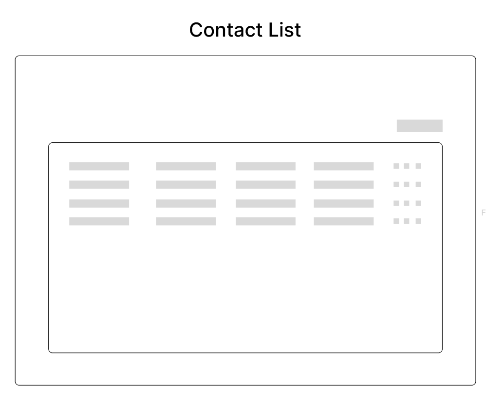
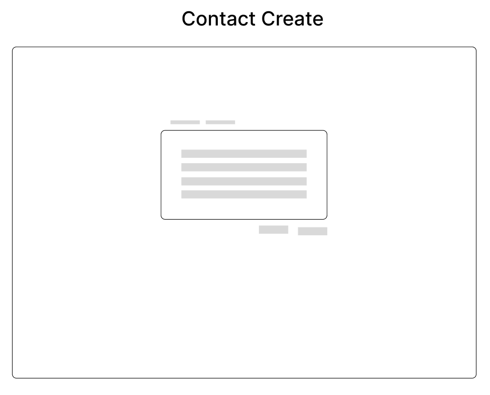
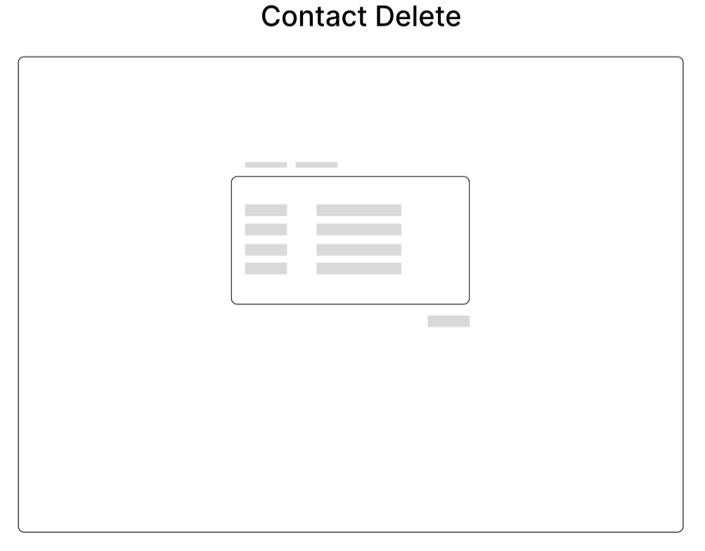
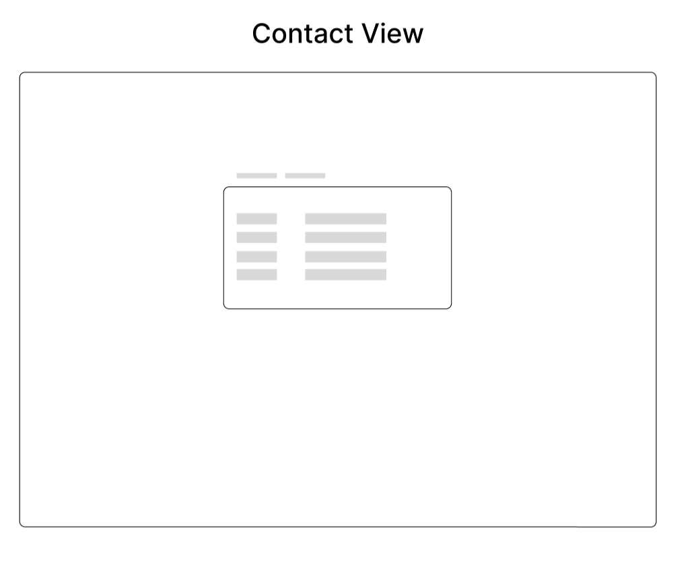
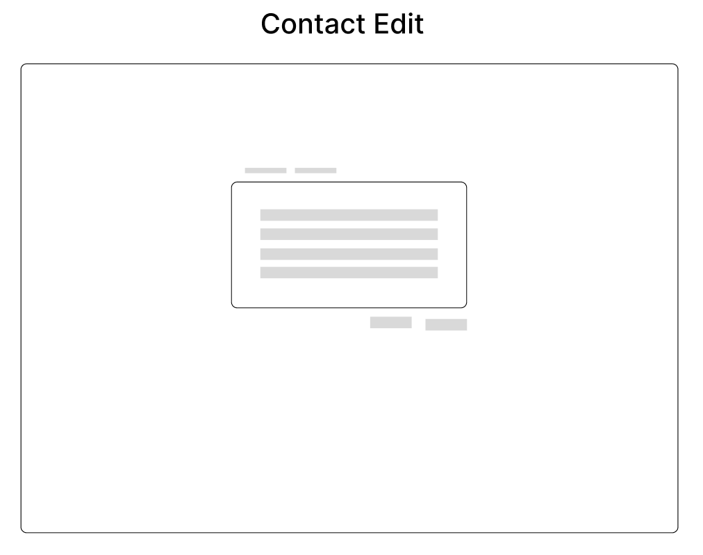

# backbone_challenge

This template should help get you started developing with Vue 3 in Vite.

## Recommended IDE Setup

[VSCode](https://code.visualstudio.com/) + [Volar](https://marketplace.visualstudio.com/items?itemName=Vue.volar) (and disable Vetur) + [TypeScript Vue Plugin (Volar)](https://marketplace.visualstudio.com/items?itemName=Vue.vscode-typescript-vue-plugin).

## Type Support for `.vue` Imports in TS

TypeScript cannot handle type information for `.vue` imports by default, so we replace the `tsc` CLI with `vue-tsc` for type checking. In editors, we need [TypeScript Vue Plugin (Volar)](https://marketplace.visualstudio.com/items?itemName=Vue.vscode-typescript-vue-plugin) to make the TypeScript language service aware of `.vue` types.

If the standalone TypeScript plugin doesn't feel fast enough to you, Volar has also implemented a [Take Over Mode](https://github.com/johnsoncodehk/volar/discussions/471#discussioncomment-1361669) that is more performant. You can enable it by the following steps:

1. Disable the built-in TypeScript Extension
    1) Run `Extensions: Show Built-in Extensions` from VSCode's command palette
    2) Find `TypeScript and JavaScript Language Features`, right click and select `Disable (Workspace)`
2. Reload the VSCode window by running `Developer: Reload Window` from the command palette.

## Customize configuration

See [Vite Configuration Reference](https://vitejs.dev/config/).

## Project Setup

```sh
npm install
```

### Compile and Hot-Reload for Development

```sh
npm run dev
```

### Type-Check, Compile and Minify for Production

```sh
npm run build
```

### Run Unit Tests with [Vitest](https://vitest.dev/)

```sh
npm run test:unit
```

### Lint with [ESLint](https://eslint.org/)

```sh
npm run lint
```

## Aliases

We have the following aliases.

| Alias              | PATH                        |
| ------------------ | --------------------------- |
| `@`                | src/\*                      |
| `@atoms`           | src/components/atoms/\*     |
| `@molecules`       | src/components/molecules/\* |
| `@organisms`       | src/components/organisms/\* |
| `@templates`       | src/components/templates/\* |
| `@views`           | src/views/\*                |
| `@domain`          | src/domain/\*               |
| `@infrastructure`  | src/infrastructure/\*       |

To add a new alias, you only have to configure the alias path in the `vite.config.ts` file.

```typescript
// vite.config.ts

alias: {
  // ... rest
  "@new": fileURLToPath(new URL("NEW_ALIAS_PATH", import.meta.url)),
},
```

And add the new alias in `tsconfig.app.json` file.

```typescript
// tsconfig.app.json

paths: {
  // ... rest
  "@new/*": ["NEW_ALIAS_PATH/*"],
},
```

## Env Variables

The project consists of some environment variables to be able to function correctly.

You must create a file in the root folder of the project called `.env.local`.

In the file called .env.example you will find the environment variables for the sandbox environment.

Environment variables must start with `VITE_` to be recognized by Vite, check out the [env variables and modes](https://vitejs.dev/guide/env-and-mode.html) to learn more.

### Add new env var

To add a new environment variable, you must first create the variable in the `.env.local` and `.env.example` files.

```
// .env.local

VITE_APP_TITLE=my title
```

```
// .env.example

VITE_APP_TITLE=my title
```

Finally, the name of the variable must be added in the following `env.d.ts` file, this helps us so that the IDE gives us the different environment variables that we have created as options. Check out the [intelliSense for TypeScript](https://vitejs.dev/guide/env-and-mode.html#intellisense-for-typescript) to learn more.

```typescript
// env.d.ts

interface ImportMetaEnv {
  readonly VITE_APP_TITLE: string;
  // more env variables...
}
```

## Project

First I made a sketch in figma of how to visualize the screens of this project, this helps me to be a little clearer how I want these screens to look at the end of the project.

The are my sketch than I have made.












### Design System: Atomic Design

Use the design system called [atomic design](https://bradfrost.com/blog/post/atomic-web-design/) to have a better order in the creation of the interfaces, which is more structured and with better guidelines.

### Hexagonal Architecture

It also implements the hexagonal architecture to build the project, since this architecture gives us more maintainability and scalability to the projects.


### Fonts

This project use [Montserrat](https://fonts.google.com/specimen/Montserrat) typography.

### SASS

This project use [SASS](https://sass-lang.com/) as CSS preprocessor
